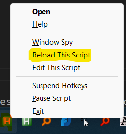

# Layer 2 Intro 

Autohotkey script that adds an extra 'layer' to the keyboard.
In layer 2, a key presses some other key.
This is meant to emulate the behaviour of 60% keyboards. In addition text macro's can be set. Useful to avoid typing repetitive stuff - "your name" "Thank you" etc.
All keys and macros functions can be easily configured. 

## Switching between layers

Press Alt to switch from/to layer 2. Can be changed to Shift/Caps/Ctrl

## Example use cases: 

1. Emulate function keys with number row. F* 
Key '1' in layer 2 will send F1 
Key '2' in layer 2 will send F2 
and so on

2. Easy access to Play/Pause and other media keys
Key 'z' in layer 2 will Play Previous
Key 'x' in layer 2 will send Play/Pause
Key 'c' in layer 2 will Play Next

3. Emulate Arrow Keys to reduce hand movement

i,j,k,l are set as left,up,down,right keys. After getting used to this, your overall productivity will increase.

## Default keys

Below are the default key mappings for Layer 2. These can be customized in the `layer2_key_mappings.ini` file.

| Key | Action            |
|-----|-------------------|
| 1   | F1                |
| 2   | F2                |
| 3   | F3                |
| 4   | F4                |
| 5   | F5                |
| 6   | F6                |
| 7   | F7                |
| 8   | F8                |
| 9   | F9                |
| 0   | F10               |
| -   | F11               |
| =   | F12               |
| z   | Media Previous    |
| x   | Media Play/Pause  |
| c   | Media Next        |
| v   | Volume Down       |
| b   | Volume Up         |
| j   | Up Arrow          |
| h   | Left Arrow        |
| k   | Down Arrow        |
| l   | Right Arrow       |
| y   | Home              |
| n   | End               |
| q   | "Thank you"       |
| u   | Page Up (commented out) |
| ,   | Page Down         |

## Configuration

The behavior of the Layer 2 script can be customized through the `layer2_general_settings.ini` file.

Settings Explanation:

| Setting           | Description                                                                                               | Default   | Options                        |
|-------------------|-----------------------------------------------------------------------------------------------------------|-----------|--------------------------------|
| layer_switch_key  | Defines the key used to switch between Layer 1 and Layer 2. Default is `alt`.                             | `alt`     | `Alt`, `Shift`, `Ctrl`, `CapsLock` |
| show_popup        | Determines whether to show a popup when switching to Layer 2. Default is `true`.                          | `true`    | `true`, `false`                |
| popup_text        | Sets the text displayed in the popup when switching to Layer 2. Default is `Layer 2`.                     | `Layer 2` | Any text                       |

**IMPORTANT** 
> After changing the configuration. Reload the script by right clicking the tray icon > 'Reload This Script'

## Installing / Using

### From source / Manually

1. **Download Source Zip File:**
   - Download the zip file from the [releases page](https://github.com/gyaaniguy/layer2keyboard/releases).

2. **Extract Zip File:**
   - Extract the contents of the zip file to a directory of your choice.

3. **Install AutoHotkey:**
   - If AutoHotkey is not already installed, download and install it from [autohotkey.com](https://www.autohotkey.com/).

4. **Run the Script:**
   - Double-click on the `.ahk` script file to run it with AutoHotkey.

### Binary / exe

1. **Download Executable  Release:**
   - Download the latest release from the [releases page](https://github.com/yourusername/repository/releases) of the GitHub repository.

2. **Extract Zip File:**
   - Extract the downloaded zip file to a directory of your choice.

3. **Run the Executable:**
   - Double-click on the `.exe` file to run the script.
